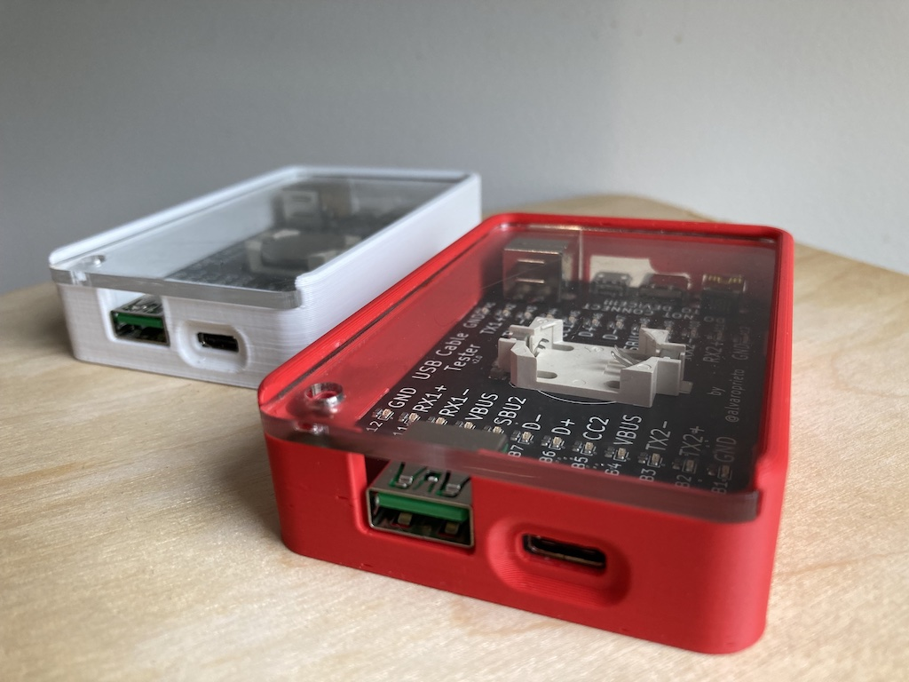

# USB Cable Tester Case

## A 3d printable case for Alvaro Prieto's USB C Cable Tester

(also requires a laser cutter for the acrylic top panel)

[USB C Cable Tester](https://github.com/alvarop/usb_c_cable_tester) - [original Twitter thread descibing the tester](https://twitter.com/alvaroprieto/status/1594036248481771520)

The red print in the front is a beautiful print done by my friend Janet. The white print in the back is my low quality print.

Print settings from my friend are quoted below in the "Printing it" section

## Screw tower

The prints you see above had a screw mount and a hole in the plexi top panel to screw it in. A few different people have printed this on a few different printers, and the screw does not seem necessary - the plexi friction fits in perfectly. This is good, because the screw tower has snapped off on every case I've printed. It's just too small to both fit thru the PCB and not break off. **The screw tower version of the model is included, but *not* recommended.**

With screw tower:

Without screw tower:

The screw hole is for an M3 screw, and the depth is 5mm so ideally a use a screw less than 7mm long (3mm for the plexy, 4mm into the tower). You might have success if you heat the tower up with a hair dryer or heat gun first.

## Printing it:

Settings used for the red print:

> I used .2 line height, 25% pla with supports, 215 nozzle, 60 bed, 50mm/s, on a ender3v2. Took about 3 and half hours. Friction fit is great and the board is held in there nicely.

For my much crappier white print, I included supports for only the ports on the back (the side with 4 ports). Printing time, at low quality, was about 1.5hrs on a Prusa clone.

## Cutting the top panel:

The plexy top panel should be cut from 2.9mm acrylic.

## Assembling:

Put the board in, place the back end (USB Type-B / micro / USB-C / mini) down first then drop the front end (usb-a / usb-c) in into the peg/screw tower. Press the board down past the four clasps on the side-walls - this might need a bit of force.

Once the board is in place, slide the plexyglass/acrylic top panel in from the front end.

If you have a screw hole / screw tower, screw it in and pray it doesn't snap off! :)

# Fusion 360 project files

The fusion project file is located in case-without-screw-tower/usb-c-tester-case-screw-v13.f3z

I think that file should have the version history included, so you can jump back to v9 for the case-with-screw-tower version - or just edit the screw tower extrusion step (Extrude 17) to go up to the underside of the plexi body, and then cut a hole in it 5mm down using the "screw-rod-hole" sketch.
 
