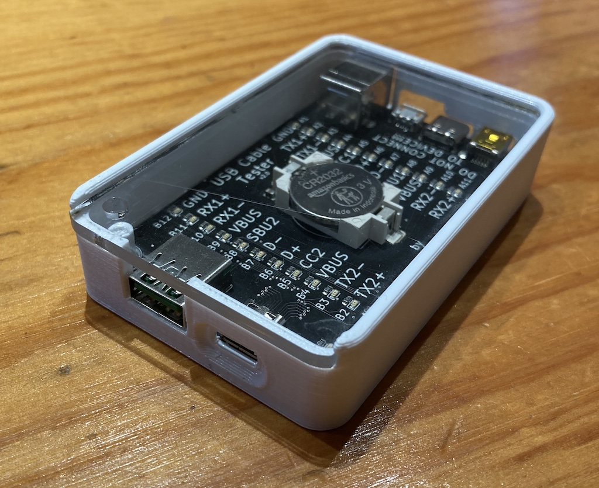
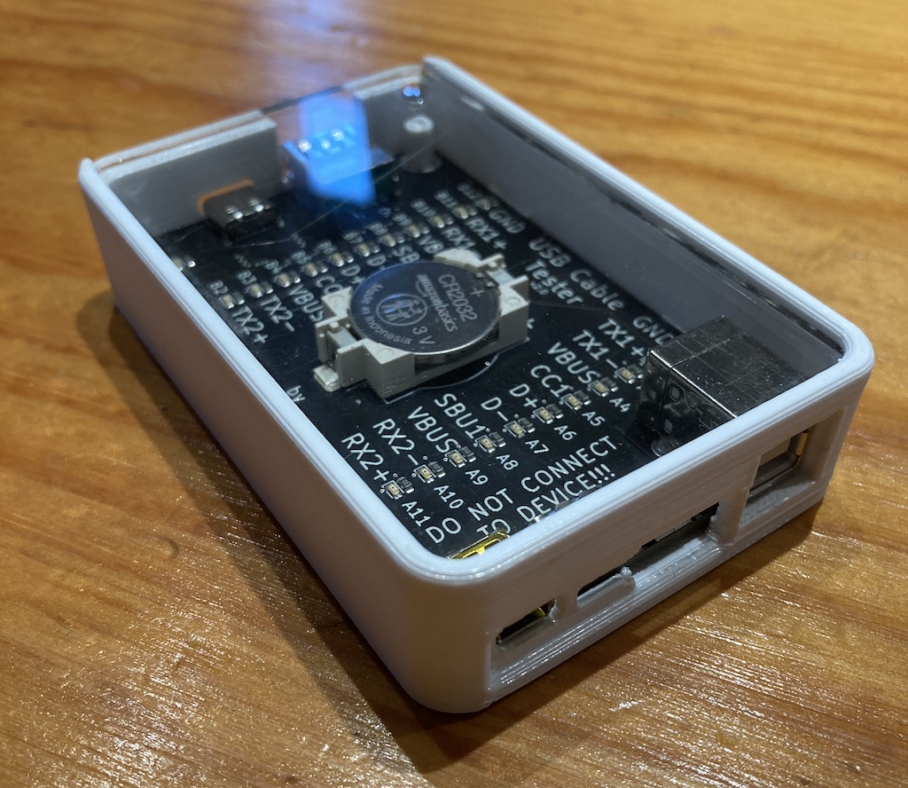
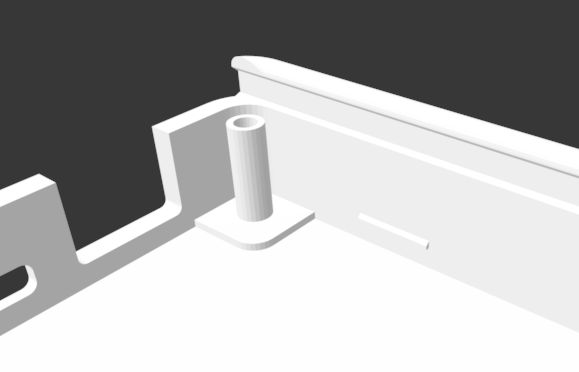
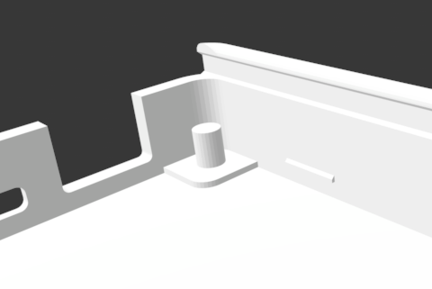

# USB Cable Tester Case

## A 3d printable case for Alvaro Prieto's USB C Cable Tester

(also requires a laser cutter for the acrylic top panel)

[USB C Cable Tester](https://github.com/alvarop/usb_c_cable_tester) - [original Twitter thread descibing the tester](https://twitter.com/alvaroprieto/status/1594036248481771520)

Test print front view:

Test print back view:

## Screw tower issue

There are two versions of this design - one with a small tower to screw into to attach the acrylic top plate - and one without.

With screw tower:

Without screw tower:

The reason for that is that the tower is VERY delicate, and I wasn't able to screw into it without it snapping off. On my print, the acrylic top plate friction-fits perfectly, but your mileage may vary. Both models are provided in case you want to try your luck with the screw mount (try heating up the tower before screwing in the first time) or need one that will stay together even if dropped.

The screw hole is for an M3 screw, and the depth is 5mm so ideally a use a screw less than 7mm long (3mm for the plexy, 4mm into the tower).

## Printing it:

You'll want supports for at least the back ports (see second test-print image). The USB-C on the front can probably be printed without supports.

Printing time, at low quality, was about 1.5hrs for me.

## Cutting the top panel:

The plexy top panel should be cut from 2.9mm acrylic.

## Assembling:

Put the board in, place the back end (USB Type-B / micro / USB-C / mini) down first then drop the front end (usb-a / usb-c) in into the peg/screw tower. Press the board down past the four clasps on the side-walls - this might need a bit of force.

Once the board is in place, slide the plexyglass/acrylic top panel in from the front end.

If you have a screw hole / screw tower, screw it in and pray it doesn't snap off! :)

# Fusion 360 project files

If you want the original fusion 360 project, shoot me a message and I can share it with you - it's parametric and pretty modifyable.
